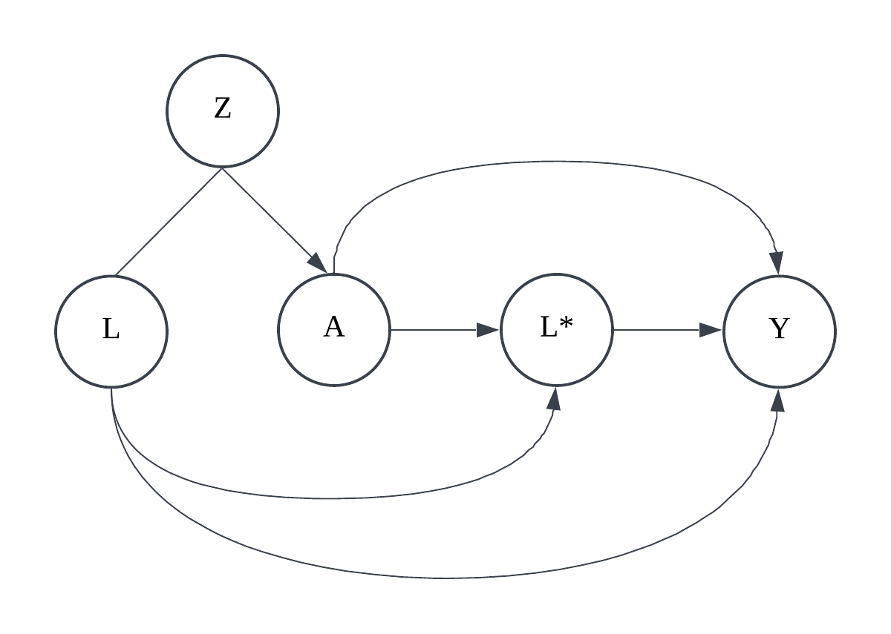

# gmm_pneumonia

This code generates pneumonia data from the DAG below and estimates the 20 simulation parameters using Generalized Method of Moments (GMM) equations.

-   $L$: true pneumonia status

-   $A$: Exposure (large vs small hospital, binary)

-   $L^*$: Observed pneumonia diagnosis

-   $Y$: Outcome (mortality, binary)

-   $Z$: Instrument variable ($k=3$ levels)

Then, the joint distribution of these five variables can be written as following:

$$
f(L)f(Z\mid L)f(A\mid Z)f(L^*\mid A,L)f(Y\mid A, L, L^*)
$$

From this, we can write,

$$
\begin{align}
P(Z=z,A=a,L^*=l^*,Y=y) &= \sum_{l=0}^1 P(Z=z,L=l,A=a,L^*=l^*,Y=y)\\
&=\sum_{l=0}^1  P(L=l)P(Z=z\mid L=l)P(A=a\mid Z=z)\\
&\qquad\qquad\qquad P(L^*=l^*\mid A=a,L=l)P(Y=y\mid A=a, L=l, L^*=l^*)
\end{align}
$$

-   $P(L=1)$: 1 parameter

-   $P(Z=z\mid L=l)$: $2k-1$ parameters

-   $P(A=1|Z=z)$: $k$ parameters

-   $P(L^*=1\mid A=a,L=l)$: 4 parameters

-   $P(Y=1\mid A=a,L=l,L^* =l^*)$: 8 parameters

With $k=3$, are 20 unknown parameters in the above distribution. Then, using these 20 parameters, we can simulate data and write the following 23 estimating equations for each level of $Z,A,L^*,Y$.

$$
\begin{multline}
\frac{1}{n}\sum_{i=1}^n \bigg[ I(Z=z,A=a,L^*=l^*,Y=y)-\sum_{l=0}^1  P(L=l)P(Z=z\mid L=l)
 \\ 
P(A=a\mid Z=z)P(L^*=l^*\mid A=a,L=l)P(Y=y\mid A=a, L=l, L^*=l^*)\bigg]=0
\end{multline}
$$
